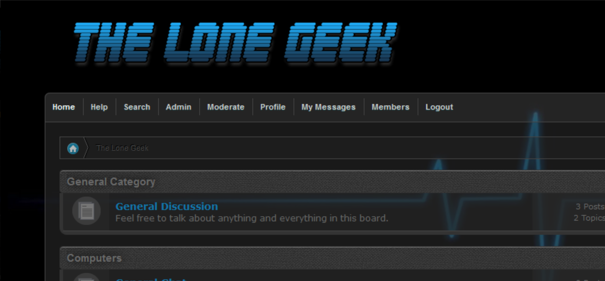

# Curve2 Dark Theme for SMF 2.1

This is an old theme I modified from the default theme. I liked it.

### Dependencies

Uses the default theme that comes with the forum installer.

### Installation

1. Install SMF 2.1.
2. Install Theme to /Theme folder of installation.
3. Go to Admin Config > Themes page of Forum and install theme in there. Simply do a directory install by appending the theme name `Curve2-Dark` to the file uri.
4. Activate.
5. Enjoy!

### Screenshot

### Notes

There may be some bugs so if you know how to fix them, please open an issue post.